# Mermaid 图表模板

## 1. 序列图 (Sequence Diagram)

适用于：展示系统各组件之间的交互流程

### 基础模板

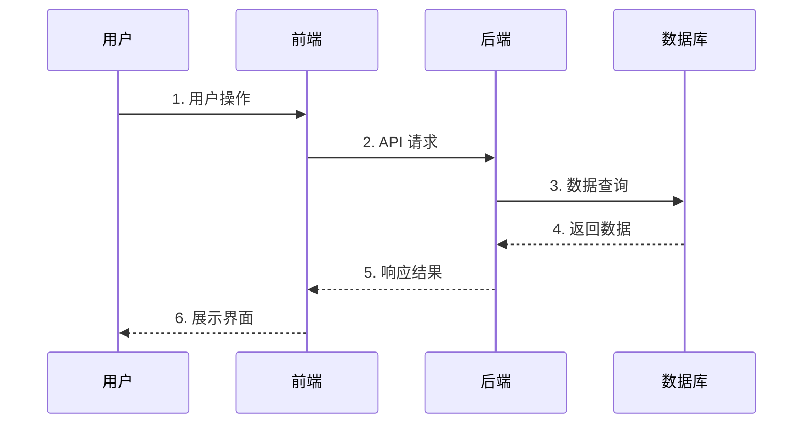

### 带条件分支的模板

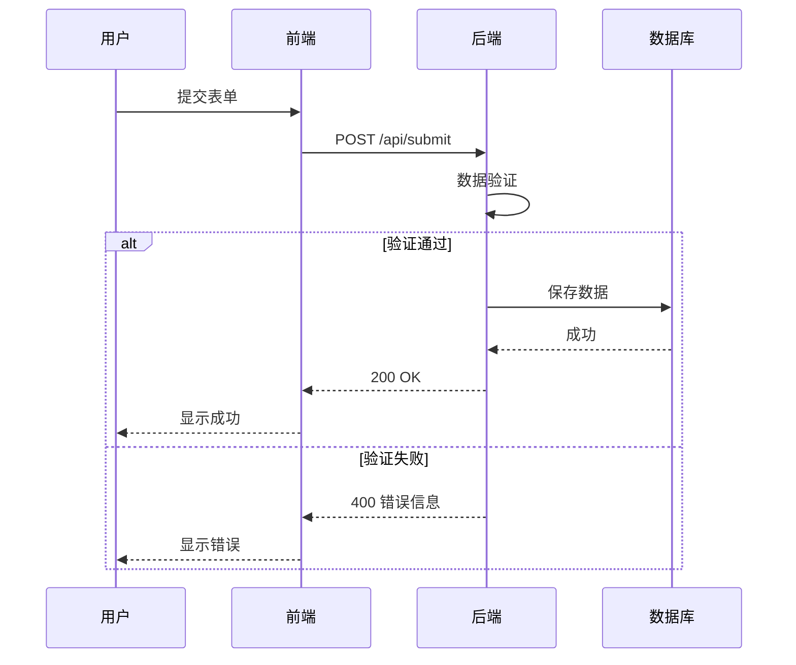

### 带循环的模板

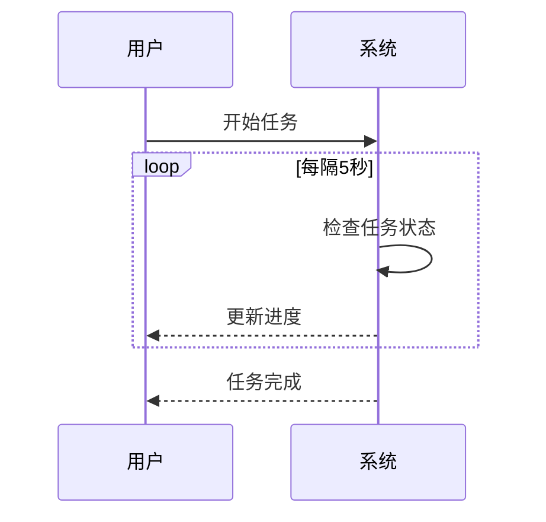

---

## 2. 流程图 (Flowchart)

适用于：展示业务逻辑、决策流程

### 基础模板（从上到下）

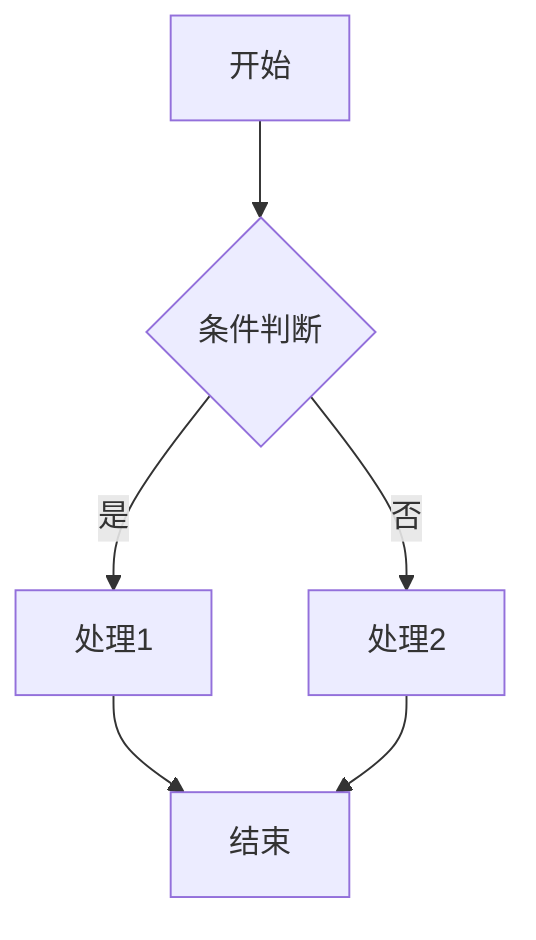

### 基础模板（从左到右）

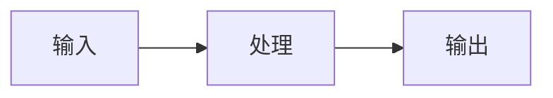

### 复杂业务流程

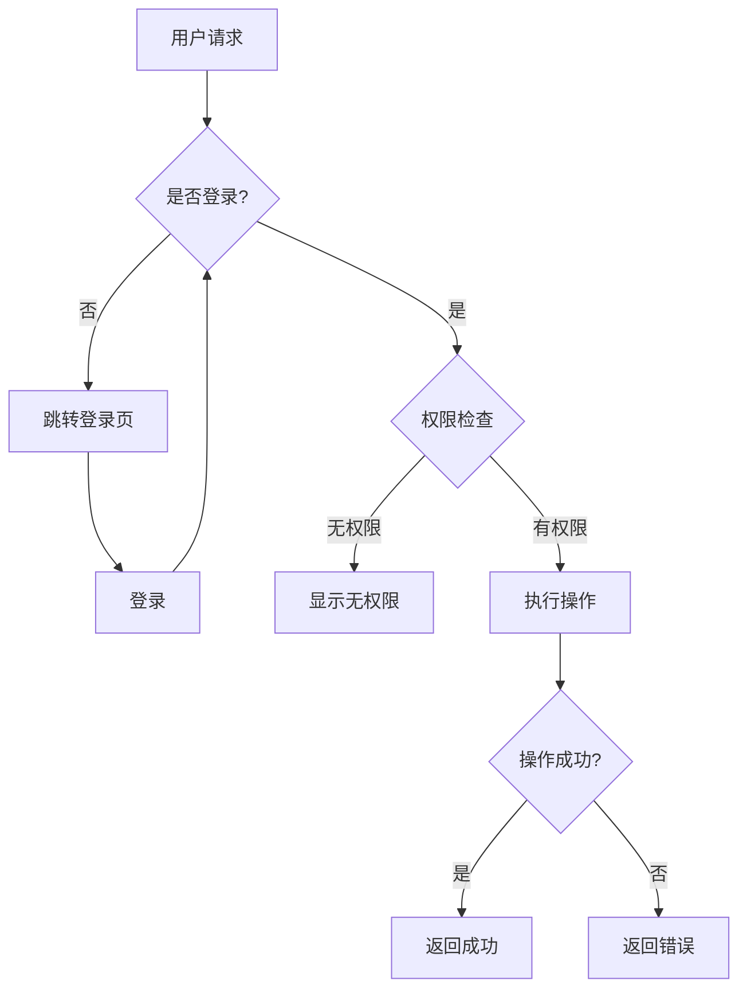

### 带子流程的模板

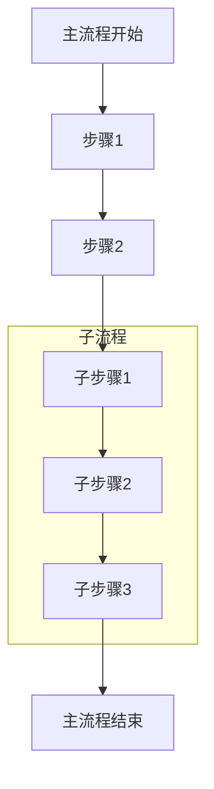

---

## 3. 状态图 (State Diagram)

适用于：展示对象的状态变化

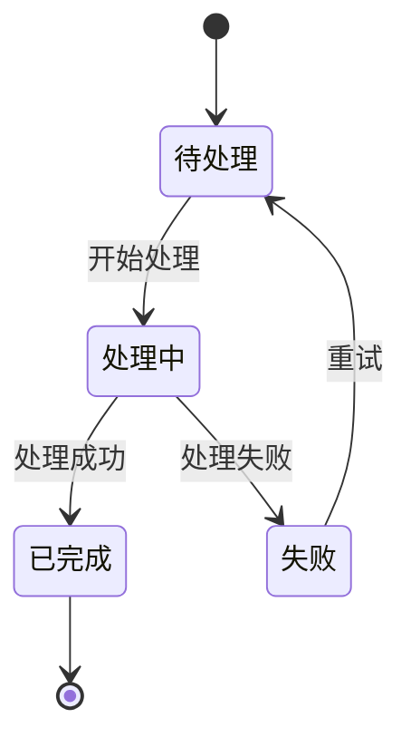

---

## 4. 实体关系图 (ER Diagram)

适用于：展示数据库表结构

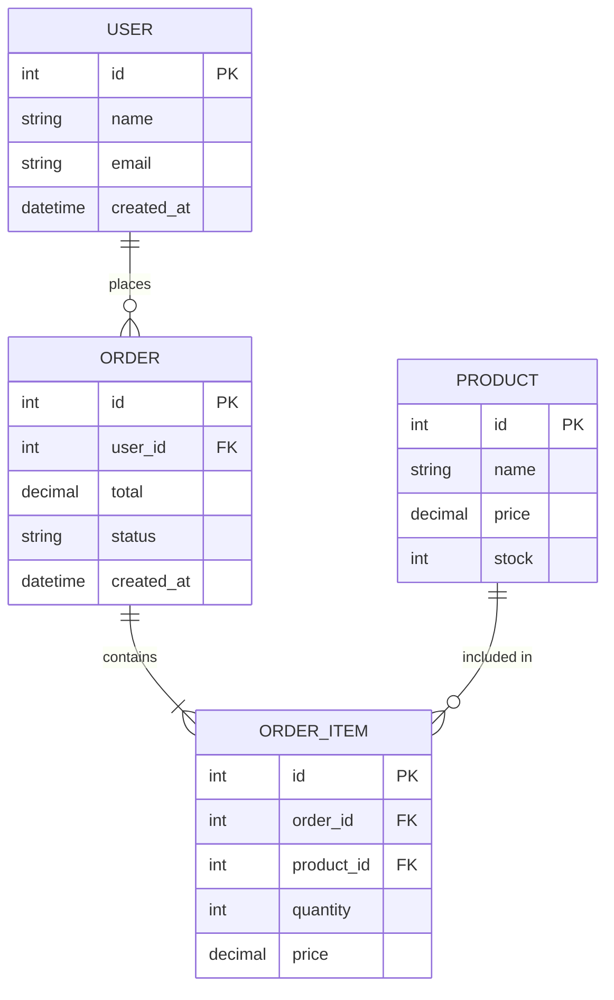

---

## 5. 类图 (Class Diagram)

适用于：展示系统架构、模块关系

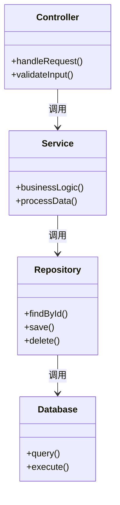

---

## 6. 甘特图 (Gantt Chart)

适用于：展示项目计划、开发进度

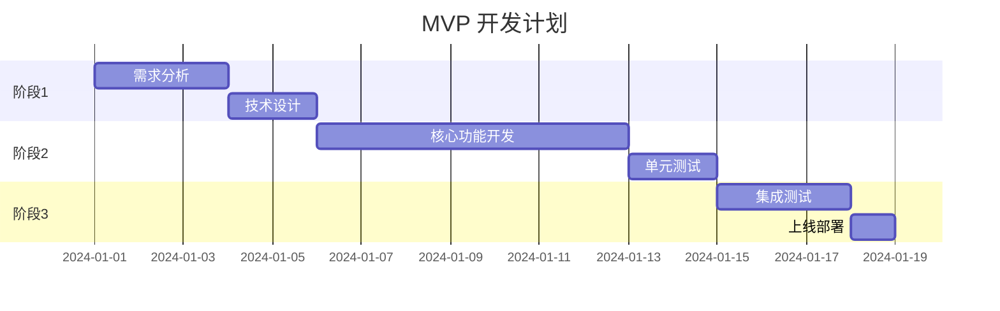

---

## 使用建议

### 选择正确的图表类型

| 场景 | 推荐图表 |
|------|----------|
| API 调用流程 | 序列图 |
| 业务决策逻辑 | 流程图 |
| 订单/任务状态 | 状态图 |
| 数据库设计 | ER 图 |
| 模块依赖关系 | 类图 |
| 开发计划 | 甘特图 |

### 图表简化原则

1. **一图一主题**：每个图只表达一个核心流程
2. **控制节点数**：单个图不超过 15 个节点
3. **命名清晰**：使用中文标注，便于理解
4. **突出重点**：核心流程放在显眼位置

### 样式建议

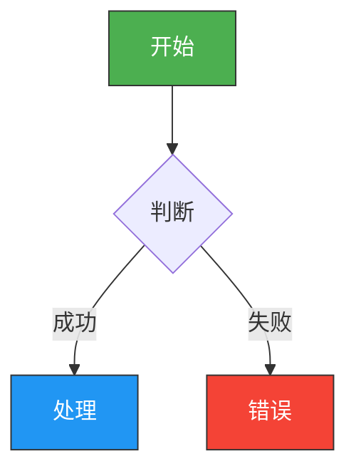
